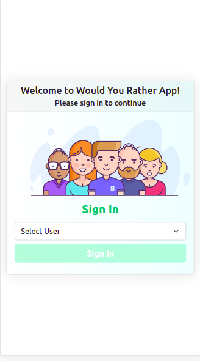

# Would You Rather Project

This is the assessment project for Udacity's React & Redux course.

### TL;DR

To get started developing right away:

-   Install all project dependencies with `npm install` or `yarn install`
-   Start the development server with `npm start` or `yarn start`
-   App launched in browser at `http://localhost:3000`

## Table of Contents

### Tools

-   [React](https://reactjs.org/)
-   [Redux](https://redux.js.org/)
-   [React Redux](https://redux.js.org/basics/usage-with-react)
-   [Redux Thunk](https://redux.js.org/docs/advanced/AsyncActions.html)
-   [React Router DOM](https://reacttraining.com/react-router/web/guides/quick-start)
-   [React Icons](https://react-icons.netlify.com/)
-   [React Bootstrap](https://react-bootstrap.github.io/)

### Features

-   Register if you don't like to use default name

*   -   Enter Your First and Last Name
*   -   Upload an Image, if you don't like to use default image

-   View Poll questions and answers
-   Create a new poll question
-   Check Leader board
-   You're redirected back to the login page if you're not logged in and redirected back to the page you were on when you logged in
